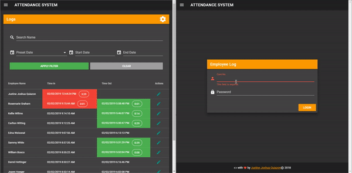

## Dotnet-Core-Attendance-System ##

Attendance Web Application using .NET Core (CQRS pattern) & Vue.js

### Circle CI ###

[](https://circleci.com/gh/jioo/Dotnet-Core-Attendance-System)

### Prerequisite ###
1. Install .Net Core 2.2 SDK [https://dotnet.microsoft.com/download](https://dotnet.microsoft.com/download)
2. Install Node.js [https://nodejs.org/en/download/](https://nodejs.org/en/download/)
3. Any relational database provider. See list at: [https://docs.microsoft.com/en-us/ef/core/providers/](https://docs.microsoft.com/en-us/ef/core/providers/)
    - Note: MSSQL is the default provider in the source code.

### Build ###
```bash
# Install Cake global tool first
dotnet tool install -g Cake.Tool

# Run build.cake
# - this task build Api & Test .net core project
# and install packages in Vue client
dotnet-cake build.cake
```

### Run ###
- Api project
```bash
cd .\src\Api\

# Run 
dotnet run

# or Run with file watcher
dotnet watch run
```
- Vue client
    - Use login: `admin` and password: `123456`
```bash
cd .\src\Api\

# Start dev w/ hot module replacement
npm run serve
```
- Integration Tests
```bash
cd .\tests\Api\

# Run tests 
dotnet test

# or Run with file watcher
dotnet watch test
```

### Local Publish ###
```bash
# Publish .net core api and vue in `/dist` folder
dotnet-cake build.cake --task="Publish"
```

### Features ###

* Fully separated Backend and Frontend
* Swagger for api documentation (URL: http://localhost:5000/swagger/index.html)
* CQRS Pattern (Command Query Responsibility Segregation)
* Authentication based on Identity Framework & JWT Bearer
* Integration Tests with XUnit
* Material design
* Realtime update on employee logs
* 


### Includes ###

* [.NET Core](https://docs.microsoft.com/en-us/dotnet/core/) open-source general-purpose development platform maintained by Microsoft. 
* [MediatR](https://github.com/jbogard/MediatR) Simple, unambitious mediator implementation in .NET
* [Vue.js](https://vuejs.org/) The Progressive JavaScript Framework.
* [Vuetify](https://vuetifyjs.com/en/) Material design component framework for Vue.js.

### Online Resources ###

* [https://docs.microsoft.com/en-us/aspnet/core](https://docs.microsoft.com/en-us/aspnet/core)
* [https://vuejs.org/](https://vuejs.org/)
* [https://vuetifyjs.com](https://vuetifyjs.com)
* [https://github.com/gothinkster/aspnetcore-realworld-example-app](https://github.com/gothinkster/aspnetcore-realworld-example-app)
* [https://medium.com/@ozgurgul/asp-net-core-2-0-webapi-jwt-authentication-with-identity-mysql-3698eeba6ff8](https://medium.com/@ozgurgul/asp-net-core-2-0-webapi-jwt-authentication-with-identity-mysql-3698eeba6ff8)